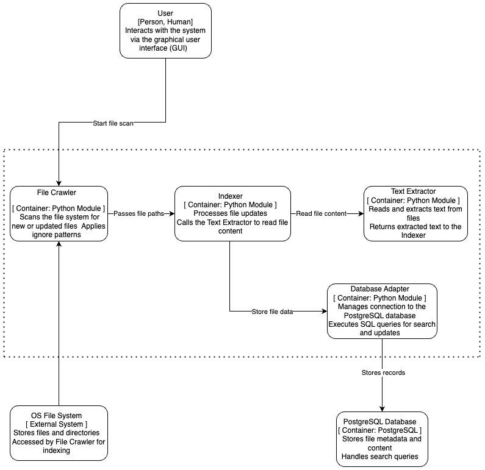

# ARCHITECTURE.md

## 1. Introduction

This document provides a **model** overview of the **Local File Search Engine**.
For this, are used the following levels of abstraction:

1. **System Context** (Level 1)
2. **Containers** (Level 2)
3. **Components** (Level 3)

### Goal

- Give a clear, high-level perspective of how this system is organized.
- Show how users and external systems interact with the application.
- Define the main building blocks (containers, components) and their responsibilities.

## 2. System Context (Level 1)

### 2.1 Diagram

### 2.2 Description

- **User (Actor)**

  - A person who interacts with the local file search engine, typically via a command-line interface or graphical user interface (GUI).
  - Enters queries, sees a list of matching files.
- **Local File Search Engine (System)**

  - The main application which is being buit and maintained.
  - Performs directory crawling, text extraction, indexing, and searching.
  - Communicates with the OS File System to read files.
- **OS File System (External System)**

  - The file and directory structure on the user’s computer.

---

## 3. Container Diagram (Level 2)

At this level, the system is broken down into **major deployable units** (containers).

### 3.1 Diagram

### 3.2 Container Descriptions

1. **Client (CLI/GUI)**

   - **Purpose**: Receive user input (search terms) and display matching results.
   - **Responsibilities**:
     - Send search queries to the Indexing Service.
     - Present the returned file paths and snippets to the user.
2. **Indexing Service (Backend Logic)**

   - **Purpose**: The “brains” of crawling, indexing, and fulfilling search requests.
   - **Responsibilities**:
     - Recursively scan directories in the OS file system.
     - Extract file text.
     - Insert or update these records in the Database.
     - Handle search queries from the Client by querying the Database and returning relevant results.
3. **Database (DB)**

   - **Purpose**: Store the indexed information for quick retrieval.
   - **Responsibilities**:
     - Maintain file info (e.g., paths, text content, timestamps).
     - Return query results to the Indexing Service.

---

## 4. Component Diagram (Level 3)

At this level the **Indexing Service** container (the most complex part) is extended to see how it’s broken down into logical components.

### 4.1 Diagram

### 4.2 Component Descriptions

- **File Crawler**

  - **Purpose**: Recursively scans directories in the OS file system to locate new or changed files.
  - **Responsibilities**:
    - Apply ignore patterns (e.g., skip hidden folders).
    - Pass discovered file paths to the Text Extractor.
- **Text Extractor**

  - **Purpose**: Convert raw files into textual data.
  - **Responsibilities**:
    - Handle `.txt` or other formats.
    - Clean/normalize the extracted text.
    - Forward extracted data to the Indexer.
- **Indexer**

  - **Purpose**: Arrange how the system updates the database with newly extracted text.
  - **Responsibilities**:
    - Determine if a file is new or updated.
    - Call the **Database Adapter** to insert or update records accordingly.
    - Maintain records of file statuses.
- **Database Adapter**

  - **Purpose**: Provide a clean interface to the Database.
  - **Responsibilities**:
    - Execute SQL commands for both indexing and search.
    - Handle connection details, error handling, and transaction management.
    - Return query results to the Indexer or Search Query Handler.
- **Search Query Handler**

  - **Purpose**: Facilitate user-driven queries.
  - **Responsibilities**:
    - Receive query terms from the Client.
    - Construct appropriate SQL or full-text queries.
    - Fetch matching records via the **Database Adapter**.
    - Return results to the Client.

---

## 5. Conclusion

This **presented architecture** outlines how our **Local File Search Engine** is structured and why.

