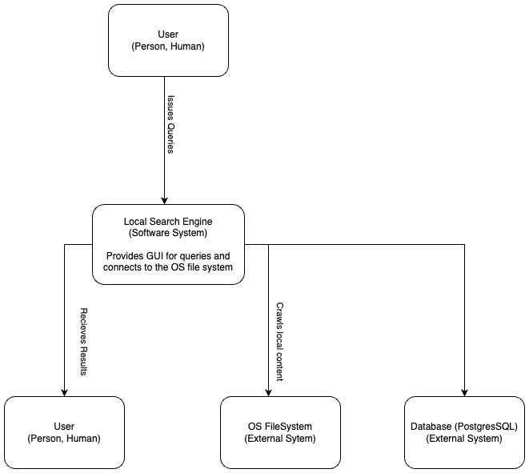
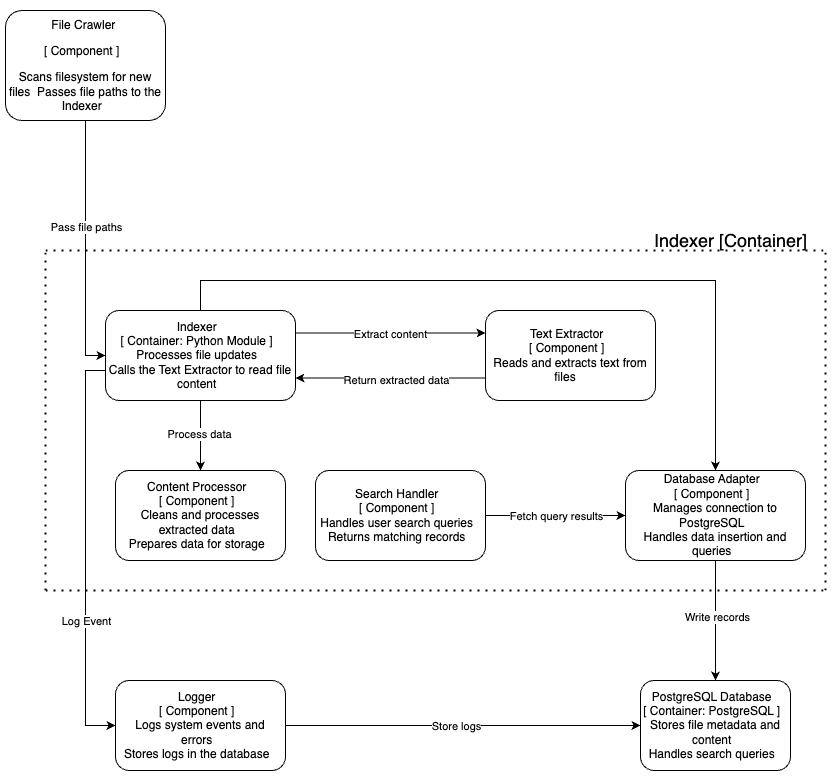

# ARCHITECTURE.md

## 1. Introduction

This document provides a **model** overview of the **Local File Search Engine**.  
For this, the following levels of abstraction are used:

1. **System Context** (Level 1)  
2. **Containers** (Level 2)  
3. **Components** (Level 3)  
4. **Database**   

### Goal

- Provide a clear, high-level perspective of how the system is organized.  
- Show how users and external systems interact with the application.  
- Define the main building blocks (containers, components) and their responsibilities.  

---

## 2. System Context (Level 1)

### 2.1 Diagram

### 2.2 Description

- **User (Actor)**  
   - A person who interacts with the local file search engine, typically via a command-line interface or graphical user interface (GUI).  
   - Enters queries and views a list of matching files.  

- **Local File Search Engine (System)**  
   - The main application being built and maintained.  
   - Performs directory crawling, text extraction, indexing, and searching.  
   - Communicates with the OS File System to read files.  

- **OS File System (External System)**  
   - The file and directory structure on the user’s computer.  

---

## 3. Container Diagram (Level 2)

At this level, the system is broken down into **major deployable units** (containers).

### 3.1 Diagram

### 3.2 Container Descriptions

1. **Client (CLI/GUI)**  
   - **Purpose**: Receive user input (search terms) and display matching results.  
   - **Responsibilities**:
     - Send search queries to the Indexing Service.  
     - Present the returned file paths and snippets to the user.  

2. **Indexing Service (Backend Logic)**  
   - **Purpose**: The “brains” of crawling, indexing, and fulfilling search requests.  
   - **Responsibilities**:
     - Recursively scan directories in the OS file system.  
     - Extract file text.  
     - Clean and process extracted data.  
     - Insert or update these records in the Database.  
     - Handle search queries from the Client by querying the Database and returning relevant results.  

3. **Database (DB)**  
   - **Purpose**: Store the indexed information for quick retrieval.  
   - **Responsibilities**:
     - Maintain file info (e.g., paths, text content, timestamps).  
     - Return query results to the Indexing Service.  

---

## 4. Component Diagram (Level 3)

At this level, the **Indexing Service** container (the most complex part) is extended to see how it’s broken down into logical components.

### 4.1 Diagram

### 4.2 Component Descriptions

### **File Crawler**
- **Purpose**: Recursively scans directories in the OS file system to locate new or changed files.  
- **Responsibilities**:
  - Apply ignore patterns (e.g., skip hidden folders).  
  - Pass discovered file paths to the Text Extractor.  
  - Notify the Indexer of new or updated files.  

---

### **Text Extractor**
- **Purpose**: Convert raw files into textual data.  
- **Responsibilities**:
  - Handle `.txt` format.  
  - Clean/normalize the extracted text.  
  - Forward extracted data to the **Content Processor**.  

---

### **Content Processor**
- **Purpose**: Prepare extracted content for storage.  
- **Responsibilities**:
  - Process and clean raw extracted data.  
  - Convert extracted content into structured format.  
  - Forward processed data to the **Indexer**.  

---

### **Indexer**
- **Purpose**: Manage how the system updates the database with extracted and processed content.  
- **Responsibilities**:
  - Determine if a file is new or modified.  
  - Pass processed content to the **Database Adapter** for storage.  
  - Log indexing activity and errors via the **Logger**.  
  - Track file statuses and updates.  

---

### **Database Adapter**
- **Purpose**: Provide a clean interface to the Database.  
- **Responsibilities**:
  - Execute SQL commands for both indexing and search.  
  - Handle connection details, error handling, and transaction management.  
  - Return query results to the **Search Handler** or **Indexer**.  
  - Manage data consistency and integrity.  

---

### **Search Handler**
- **Purpose**: Facilitate user-driven queries and present relevant results.  
- **Responsibilities**:
  - Receive query terms from the Client.  
  - Construct appropriate SQL or full-text queries.  
  - Fetch matching records via the **Database Adapter**.  
  - Return search results to the Client.  
  - Provide ranked and highlighted search results.  

---

### **Logger**
- **Purpose**: Manage system logging and error tracking.  
- **Responsibilities**:
  - Record indexing, processing, and search events.  
  - Capture and store error logs.  
  - Provide logging data to the database for system diagnostics.  

---

### **PostgreSQL Database**  
- **Purpose**: Store file metadata and content for fast retrieval.  
- **Responsibilities**:
  - Store file path, size, type, and extracted text content.  
  - Store logs and indexing events.  
  - Handle search queries and provide ranked results.  

---

### **OS File System**  
- **Purpose**: Provide access to files and directories.  
  

---

## 5. Database Diagram

### 5.1 Diagram

---

### 5.2 Database Structure
The database is implemented using **PostgreSQL** and contains the following tables:

### **1. Files Table**  
The `files` table stores metadata for each indexed file. Each record represents a unique file.  

---

### **2. Contents Table**  
The `contents` table stores the extracted text from each file. It is linked to the `files` table using a **foreign key**.  

---

**Relationship:**  
- One-to-One relationship with the `files` table (each file can have only one content record).  
- `file_id` is defined as a **foreign key** that references `files.id`.  

### **3. Logs Table**  
The `logs` table records events and error messages generated during indexing, processing, and searching.  

 **Purpose:**  
- Logs system activity and errors for easier debugging and monitoring.  
- Helps with troubleshooting system behavior and performance issues.  

---

### **Relationships Overview**  
- **files.id** -> **contents.file_id** → One-to-One relationship  
   - Each file has one content entry.  
- The `logs` table is independent and does not have direct foreign key relationships with other tables.  

---

### **Constraints and Indexes**  
- **Primary Keys:**  
   - `id` in all tables is defined as a primary key.  
- **Foreign Keys:**  
   - `contents.file_id` references `files.id`.  
- **Indexes:**  
   - `file_path` in `files` is indexed for faster lookups.  
   - `file_name` and `extension` are also indexed for efficient searching.  

---

## **Why This Design?**
- The separation of `files` and `contents` allows the system to update file metadata without touching the content.  
- The `logs` table is kept separate to avoid impacting search and indexing performance.  
- Indexing key fields (`file_path`, `file_name`) ensures fast search responses.  

## 6. Conclusion

This **presented architecture** outlines how our **Local File Search Engine** is structured and why.

